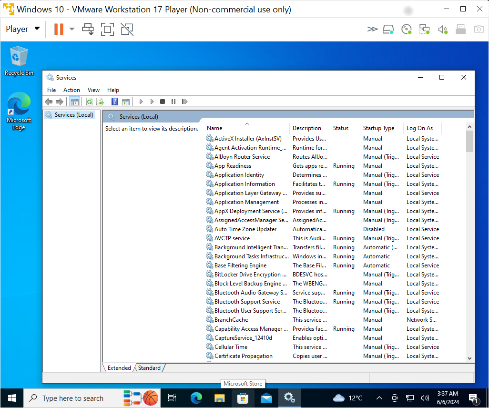
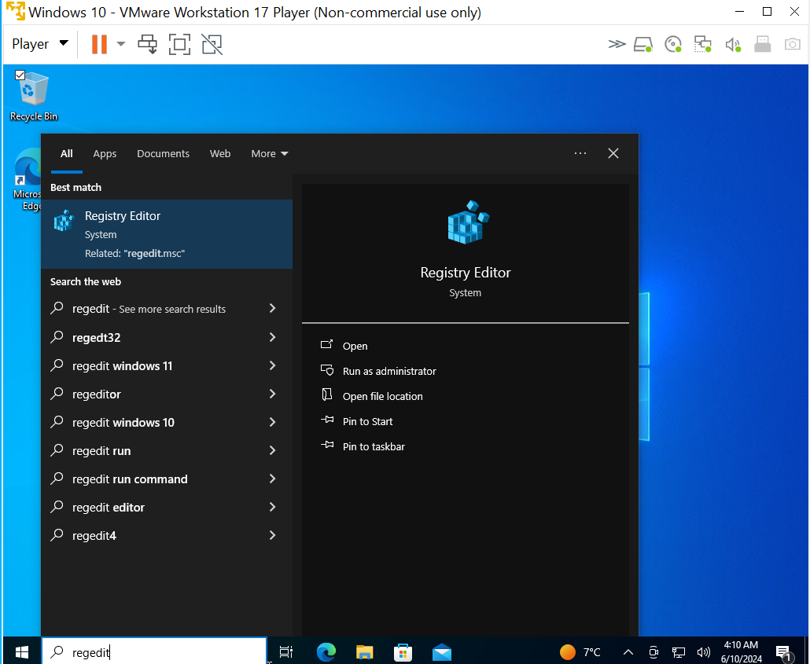

# Vulnerability Management Lab Project with Nessus
## Objective

- Prepare Nessus Vulnerability Management Scanner
- Prepare Client Virtual Machine
- Perform Basic Scan against the Windows 10 VM
- Setup the VM To Accept Authenticated Scans 
- Perform Vulnerability Scan after providing credentials to Nessus
- Compare and Remediate Vulnerabilities
- Verify Remediations

### Environments and Technologies Used:

- Nessus Essentials
- VMware Workstation Player
- MS Windows 10 ISO
- Virtual Machine

<details close>

<div>

</summary>

#### In this lab, we make concerted efforts to scan for vulnerabilities in the system and perform remediation processes in order to lower susceptibility. <b>

## Prepare Nessus Vulnerability Management Scanner
1. Download and install VMWare player.
2. Download Window 10 ISO
3. Download, install Nessus on local machine after registering and receiving activation code.


4. Next on the installation welcome page that displays, Click connect via SSL, advanced, proceed to localhost. 


5. Then click next and select - Register for Nessus Essentials, then click continue. 

6. Then provide activation code from your email. Then create username and password. Next, Nessus download plugins to finish setup.


## Prepare Client Virtual Machine
1. Install and launch VMware Workstation Player on your local machine to setup Windows 10 virtual machine. Click Player → File → New Virtual Machine → Browse then select the ISO image → Next → Add the name → disk size → Next → Customize Hardware (set Memory,CPU, Network Adaptor:Bridge (so that both VM and local machine can communicate with each other)) → Finish.

2. As VM launches, click next and complete the installation of Windows 10 Pro accordingly, including username and password.


## Perform Basic Scan against the Windows 10 VM
1. This first basic scan is to confirm that all the setup is in order and you can get a scan result. First we locate its IP4 address by login into the VM: In the search field on the Start bar → type CMD → ipconfig. 


2. Ping the VM from our local machine in this case; using ```ping 10.0.0.187 -t``` to confirm if we can reach it. But it timeouts. 

3. We would need to disable the internal firewall in the VM. Type wf.msc in the search bar on the VM to launch the Windows defender firewall console. To disable the firewall properties we turn off the firewall state for the Domain Profile, Private Profile and Public Profile. After this, notice that the IP pinging stops timing out showing that the VM is now reachable.


4. Next, perform a basic scan to confirm that the settings are in order: At Nesses Essentials web portal, click New Scan → Basic Network Scan → Add Name (You can name it any name), Targets (add the IP of the windows 10 VM)  → Save. Click on the play button to launch the scan. 


5. Further vulnerabilities are detected when credentials are used than the basic scan with no credentials. When the scan has finished we can click on it to display the scan results. Nessus uses colours to indicate the vulnerabilty severity level. Critical, High, Medium, Low and Info. We can also click on the Vulnerability tab next to the Host tab to see more details. We can click on each result listed, review the description and implement the suggested solution to remediate the vulnerability. Clicking the 'Target Credential Status...', from the description and output, we see that Nessus detected SMB on port 445 but no credentials were provided. SMB local checks were not enabled.


## Setup the VM To Accept Authenticated Scans
1. Next, we go to the VM and launch the Services pane by typing services in the search bar. Enable Remote Registry and turn it on (this will allow the scanner to connect to the VM registry and crawl to look for insecure configurations): Double click on it → Start Type: Automatic → Apply/Start → OK → Close services pane.



2. Ensure file and printer sharing are turned on the VM. 


3. Change notification settings to 'Never notify' in the User Account Control Settings, to disable it on the VM. 


4. Add a Key to the registry to further disable user account control for the remote account that will be used to connect to the computer.


## Perform Vulnerability Scan after providing credentials to Nessus
- Within Greenbone / OpenVAS, go to Scans → Tasks, CLONE the “Scan - Azure Vulnerable VMs” Task, then Edit it:
Name / Comment → “Scan - Azure Vulnerable VMs - Credentialed”, Targets: Azure Vulnerable VMs - Credentialed Scan
Save, Click the Play button to launch the new Credentialed Scan, wait for it to finish, It will take longer than the last one. Wait for it to finish, After the credentialed scan finishes, you can immediately see the difference in findings: 

## Compare and Remediate Vulnerabilities
- Check SMB Login under “Results”
Further inspect the individual vulnerabilities and see all the Criticals from the out-of-date FireFox
Remove the Filter (upper right)

## Verify Remediation
- Log back into your Win10-Vulnerable VM
Uninstall Adobe Reader, VLC Player, and Firefox
Restart the VM and Verify Remediations. 

## Conclusion
Verify remediations and start all over from 5. till vulnerabilities report is low or at an acceptable level.

